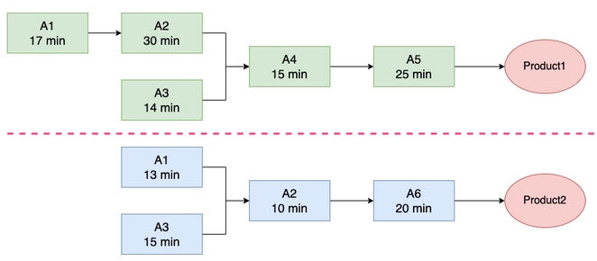
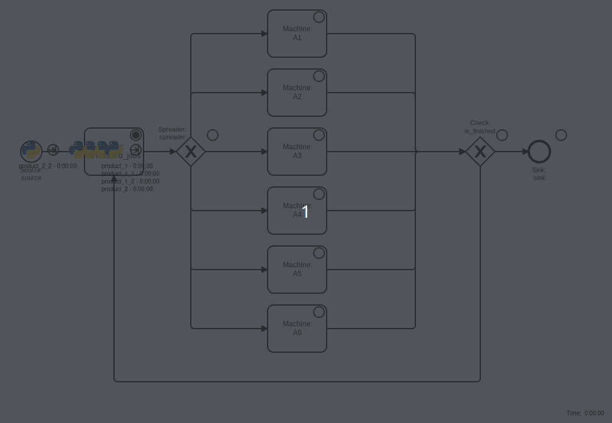

# job shop with precedence constraints simulated with simpy/casymda

Simple simpy/casymda simulation model for a job shop with 6 machines, as described in [this stack-overflow question](https://stackoverflow.com/questions/75796443/simulating-factory-manufacture-with-simpy-by-requesting-multiple-resources-at-th)
Each job may have additional precedence constraints, i.e. the job may not be started before the completion of the jobs it depends on.  

Sample product graph (copied from the stackoverflow question):



`Product1` is created by `Job1` (processed on `A4` and `A5`), which depends on the completion of `Job1_1` (processing `product1_1` on `A1` and `A2`) and `Job1_2` (processing `product1_2` on `A3`).

Animation of the modelled process:



First, all jobs (including the "pre-product"-jobs) are created and moved to a buffer, which only releases jobs which are ready (all jobs they depend on are completed).
After being released, jobs wait for their next machine to become available, and cycle back after completion of the processing step until all steps are completed.
Machines are modelled as casymda-blocks which internally use simpy-`resources` to restrict the number of concurrently processed jobs (to one).

To track the completion of predecessor-jobs on which a job depends, a simpy `AllOf`-event is used to execute a callback signaling that a depending job may be started:

```py
all_preceding_jobs_completed = AllOf(
    env, preceding_jobs_completion_events
)
all_preceding_jobs_completed.callbacks.append(
    job.is_ready_event.succeed
)
```

## setup

```sh
pip install casymda
python run_sim_web_process_animation.py
# visit http://localhost:5002 to run the model with animation
```
